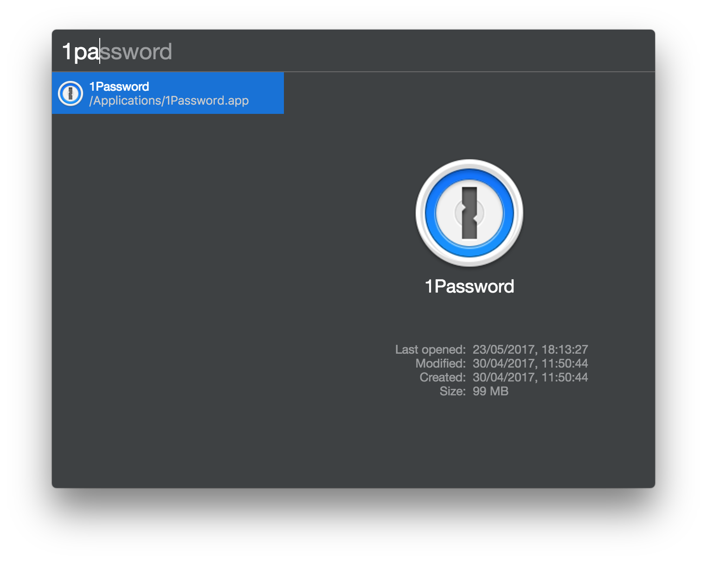

# cerebro-basic-apps

> Basic plugin for search and launch applications  with [Cerebro app](https://www.cerebroapp.com)

Note: on MacOS preferred plugin is `cerebro-mac-apps`.

## Usage
Search for any application on your machine.

## Features

* Use `enter` to launch application;
* Use `cmd/ctrl+r` to show application in Finder or files explorer;
* Shows icons for your applications.

## Related

* [Cerebro](https://github.com/cerebroapp/cerebroapp) – main repo for Cerebro app;
* [cerebro tools](https://github.com/cerebroapp/cerebro-tools) – package with tools to simplify package creation;

## License

MIT © [Alexandr Subbotin](https://asubbotin.ru)
